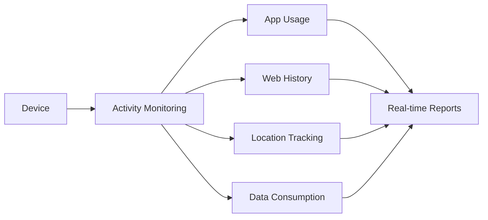
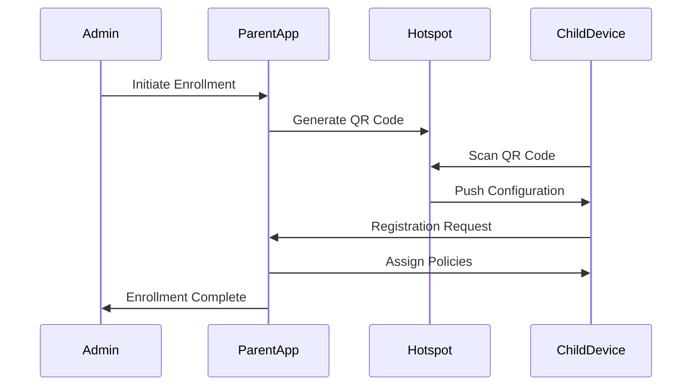

# Enhanced Parent App: GateKeeper Control Center

## Overview
The enhanced Parent App transforms your device into a powerful command center for managing all devices connected to your GateKeeper hotspot. With advanced monitoring, control, and security features, you gain unprecedented oversight of your device ecosystem.


## Key Enhancements

### 🛠️ Advanced Device Management
- **Multi-Device Dashboard**: View all connected devices at a glance with status indicators
- **Hierarchical Grouping**: Create device groups (e.g., "Kids Devices", "Work Phones")
- **Automated Provisioning**: One-tap setup for new devices
- **Remote Configuration**: Push settings to multiple devices simultaneously

### 🔍 Deep Monitoring System


### ⚡ Real-time Control Features
- **Screen Mirroring+**: Enhanced remote control with keyboard/mouse input
- **Remote Shell Access**: Execute commands on child devices
- **Session Recording**: Capture screen activity for later review
- **Cross-Device File Transfer**: Drag-and-drop between devices

### 🔒 Enterprise-grade Security
- **Geofence Alerts**: Receive notifications when devices leave designated areas
- **Usage Thresholds**: Automatic internet suspension when limits reached
- **Remote Lock/Wipe**: Protect lost or stolen devices
- **App Blacklisting**: Block unauthorized applications

### 📊 Intelligent Insights
- **Behavior Analytics**: Detect unusual usage patterns
- **Productivity Scoring**: Measure device utilization efficiency
- **Data Usage Forecasting**: Predict future consumption
- **Automated Reports**: Schedule PDF/CSV exports

## Technical Specifications

### Core Architecture
```kotlin
class GateKeeperCore : Service() {
    // Unified device management system
    val deviceManager = DeviceManager(context)
    
    // Real-time communication hub
    val commandBus = MQTTCommandBus("ssl://gatekeeper-hub:8883")
    
    // Security enforcement engine
    val policyEngine = PolicyEngine(
        rules = listOf(GeofenceRule(), DataLimitRule(), AppRestrictionRule())
    )
    
    // Automated task scheduler
    val taskScheduler = WorkManager.getInstance(context)
}
```

### Enhanced Mirroring Protocol
```
1. Request Screen Capture (WebSocket)
2. Establish WebRTC Connection (DTLS-SRTP)
3. Stream H.265 Video (Adaptive Bitrate)
4. Input Channel (Encrypted Websocket)
5. Bi-directional File Transfer (QUIC Protocol)
```

## Setup Guide

### Initial Configuration
1. Create administrator profile
2. Define device groups
3. Set global policies
4. Configure alert thresholds
5. Establish geofence boundaries

### Device Enrollment


## Usage Scenarios

### Remote Management Workflow
1. Select target device from dashboard
2. Choose action:
   - Live View (Screen Mirroring)
   - File Explorer
   - App Management
   - Command Terminal
3. Execute commands in real-time
4. Review audit log of actions

### Automated Policy Enforcement
```python
# Sample geofence rule
def check_geofence(device):
    if device.location not in SAFE_ZONES:
        send_alert(f"Device {device.id} left safe zone")
        if device.policy.auto_lock:
            device.lock()
            
    if device.location in RESTRICTED_ZONES:
        device.suspend_internet()
```

## Security Framework

### Multi-layered Protection
| Layer | Technology | Function |
|-------|------------|----------|
| **Authentication** | FIDO2 WebAuthn | Device-bound credentials |
| **Transport** | DTLS 1.3 + TLS 1.3 | End-to-end encryption |
| **Data Storage** | AES-256 + TPM Sealing | Hardware-backed encryption |
| **Audit** | Blockchain Ledger | Immutable activity logs |

### Compliance Features
- GDPR-compliant data handling
- COPPA-compliant child protection
- Regular third-party security audits
- Ethical usage monitoring system

## System Requirements

### Parent Device
- Android 12+ (with TEE support)
- Minimum 6GB RAM
- 128GB storage recommended
- Dedicated VPN connection

### Child Devices
- Android 9.0+
- GateKeeper Agent 2.0+
- Always-on internet connection

## License & Compliance
- **Personal Enterprise License**: Unlimited devices for personal use
- **Usage Restrictions**: Devices must be legally owned by license holder
- **Data Sovereignty**: All data remains on your devices
- **Audit Trail**: Comprehensive activity logging

> **Ethical Usage Notice**: This system must only be used on devices you legally own. Regular usage audits will verify compliance with ethical standards.

---

**GateKeeper Control Center v3.0** © 2025 - Personal Enterprise Edition  
*The ultimate device management solution for technology custodians*
